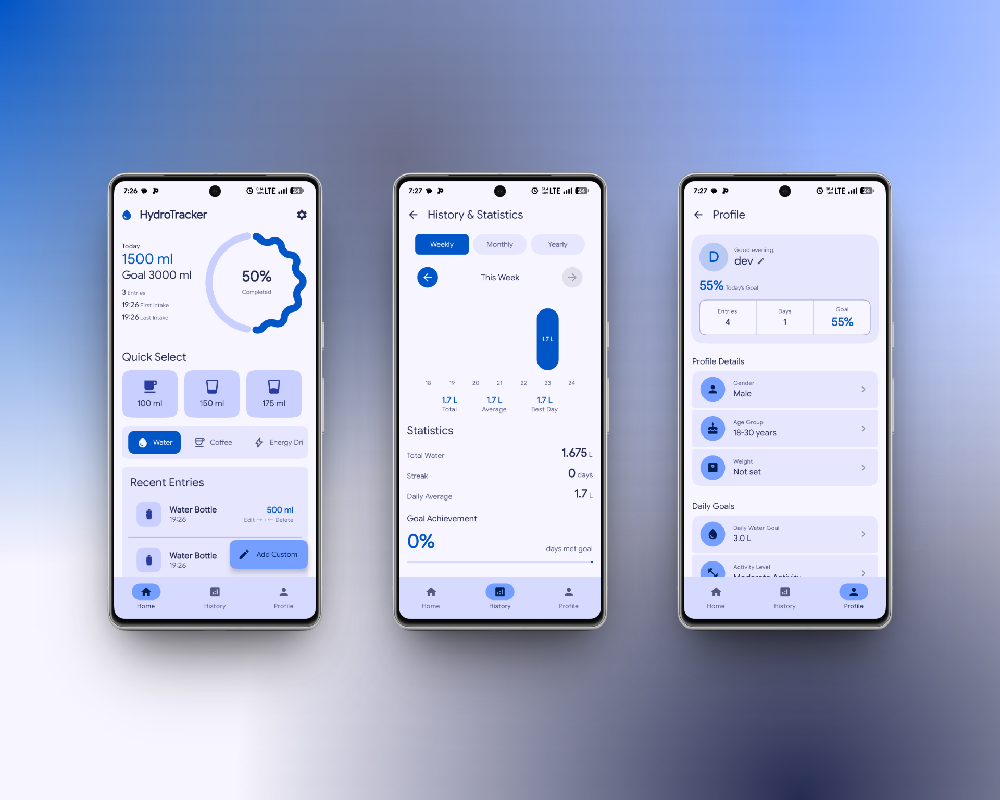

# HydroTracker

  

  <strong>A modern, private, and intelligent water intake tracking application.</strong> 
  No Ads • No Subscriptions • Completely Offline

  <a href="#features">Features</a> •
  <a href="#installation">Installation</a> •
  <a href="#technical-details">Technical Details</a> •
  <a href="#license">License</a>

  
  
  
  
  

  <em>This project is a refined fork of the original HydroTracker project, featuring additional improvements, bug fixes, and modernizations.</em>

---

  

---

## ✨ Features

### 💧 Core Functionality
* **Daily Water Tracking:** Log your hydration effortlessly.
* **Multiple Beverage Types:** Track water, tea, coffee, and more with specific hydration multipliers.
* **Smart Goal Calculation:** Get personalized targets based on your unique profile.
* **Real-Time Progress:** See exactly where you stand throughout the day.

### 📊 Analytics & History
* **Comprehensive Statistics:** View daily totals, averages, and actionable hydration insights.
* **Visual Reports:** Explore weekly bar charts, monthly heatmaps, and yearly activity calendars.
* **Progress Tracking:** Monitor your streaks, success rates, and goal completions over time.
* **Historical Navigation:** Easily browse through past weeks, months, and years.

### 🔗 Health Connect Integration
* **Seamless Sync:** Read and write hydration data directly to Android Health Connect.
* **Ecosystem Support:** Import data from Samsung Health, Google Fit, Fitbit, Garmin, and Strava.
* **Smart Detection:** Automatically detect and manage entries from external sources to prevent duplicates.

### 📱 Home Screen Widgets
Keep your progress visible without opening the app using our dynamic, real-time widgets:
* **HydroProgress** (4x1)
* **HydroCompact** (2x1)
* **HydroLarge** (4x2)

### 🔔 Smart Notifications
* **Context-Aware Reminders:** Get nudged exactly when you need to drink.
* **Adaptive Scheduling:** Reminder logic that adjusts to your daily goals.
* **Boot Persistence:** Your reminders stay active even after restarting your device.

### 🎨 Personalization
* **Modern Design:** Built with Material 3 Expressive guidelines.
* **Dynamic Theming:** UI colors adapt beautifully to your system wallpaper.
* **Dark Mode:** Native support for comfortable viewing in low light.
* **Advanced Customization:** Tailor the app settings to fit your personal workflow.

### 🔬 Scientific Foundation
* **Beverage Hydration Index (BHI):** Scientifically backed hydration calculations.
* **Global Standards:** Built around EFSA and IOM hydration guidelines.
* **Dynamic Adjustments:** Intake goals automatically adapt based on your activity levels.

*For detailed research sources, check the app settings or read our [sources.md](app/src/main/assets/sources.md).*

---

## 🚀 Installation

Download the latest APK directly from our releases page:

  

---

## 💬 Support

Need help or want to suggest a feature?
* **Bug Reports & Feature Requests:** [Open a GitHub Issue](../../issues)

---

## 🛠️ Technical Details

**Built With:**
* Kotlin
* Jetpack Compose
* Material 3 Expressive
* Android Health Connect
* WorkManager
* Room Database

**System Requirements:**
* Android 8.0+ (API Level 26 or higher)

---

## 📄 License

This project is open-source and licensed under the **GPL v3 License**.